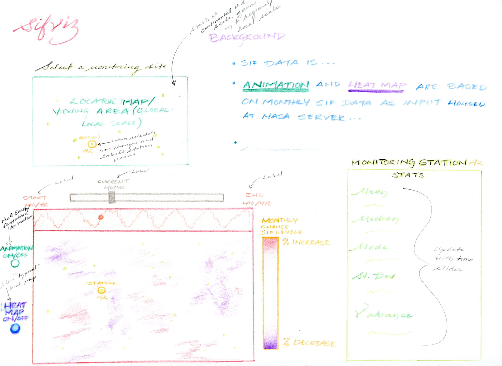
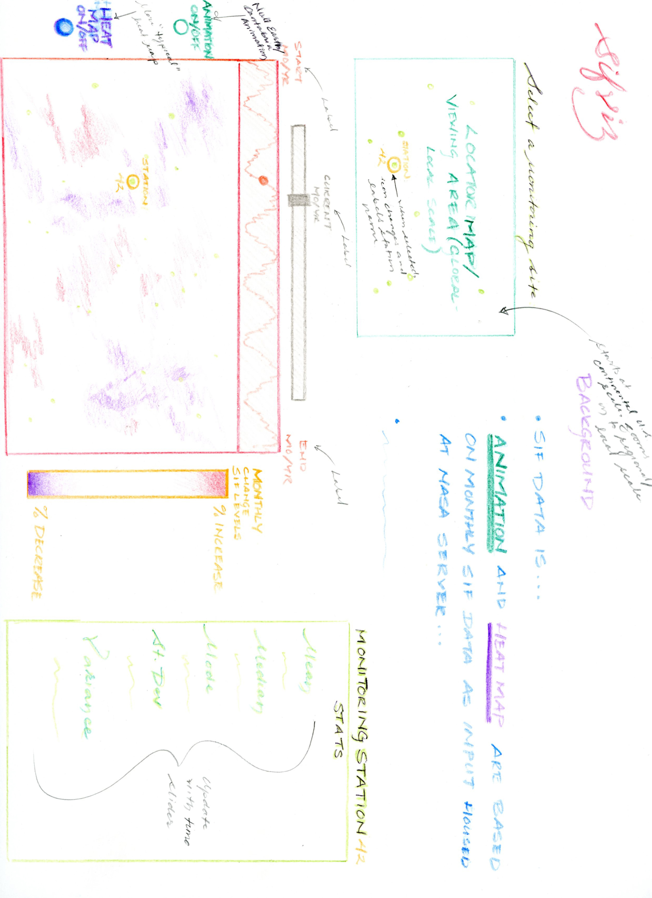

# Visualizing Solar-Induced Chlorophyll Fluorescence (SIF) by Timeframe and Region

**Group Members:** Lila Leatherman and Bran Black

**Motivation:** Both Lila and Bran have an interest in developing tools capable of expressing change in remotely sensed data over time. The problem of displaying shifts in SIF responses over time is a good representation of both the type of input data and change detection techniques Lila and Bran plan to work with in future research, making this project an excellent case study both students may adapt for future uses.

**Project Description:** We intend to create a tool capable of displaying SIF data by user-selected region over a specified time period. Special focus will be given to providing a means for users to detect changes within SIF over time, such as seasonal shifts in fluorescence or vegetative responses to drought. The shift in SIF values over the prescribed time period will be displayed as a heat map, either as a static map output or as an animation over time. Ideally, we will include various general zonal statistics of the selected area over the designated timeframe (mean, variance, average time series over the location, etc.). This analysis-heavy multi-view will be centered on using different methods of visualizing change over space and time. 

**Data:**

Solar-induced chlorophyll fluorescence (SIF) is a relatively new remote sensing index. In contrast to traditional vegetation indices (NDVI, EVI), SIF is connected to the physiology of plant production, rather than the greenness of vegetation. SIF is also more sensitive to intra-annual variation in production related to heat and drought stress. SIF is correlated with the light use efficiency of photosynthesis (LUE; Guanter et al.2014) and with absorbed photosynthetically activeradiation (APAR; Rossini et al. 2010). Thus, SIF provides an ideal proxy for gross primary production (GPP) of an ecosystem.

SIF is measured by the NASA GOME-2 satellite at 0.5 decimal degree spatial resolution. SIF data products cover the globe, and are provided at daily and monthly temporal resolution, from 2002-present. SIF data are uploaded shortly after they are observed, and are available from [NASA](https://avdc.gsfc.nasa.gov/pub/data/satellite/MetOp/GOME_F/). All of our data will be sourced from this site. For this project, we will use monthly data to minimize processing. A focus of our data visualization will be quantifying and visualizing the impacts of a 2012 drought on North America.

For more info about SIF, check out this article from [NASA's Jet Propulsion Lab](https://www.jpl.nasa.gov/news/news.php?release=2014-097).

This image shows chlorophyll fluorescence over the Corn Belt in the central US in July, averaged from 2007-2011.

**Interface Design:**

[d3heatmap](https://blog.rstudio.com/2015/06/24/d3heatmap/): a geovizualization package capable of similar to the heatmap and heatmap.2 packages, but with expanded user interaction (zooming, highlighting, etc.).

[Map-with-Latitude-Longitude](http://bl.ocks.org/lokesh005/7640d9b562bf59b561d6) : simpler user interface where data selected by points alone

[contour plot](https://bl.ocks.org/mbostock/4241134): contour plot of data that may be useful in displaying difference in SIF data over time

[Geoplotlib](https://www.researchgate.net/publication/305983877_Geoplotlib_a_Python_Toolbox_for_Visualizing_Geographical_Data): A Python toolbox that include the capablity to produce heatmaps

[myheatmap](https://myheatmap.com/): example Mapbox geovisualization aimed at heatmapping

**Interface Sketch**

Below is a sketch outlining our basic website layout. A locator map displaying selectable SIF monitoring sites is displayed in the upper left corner. A time slider sits directly below, with an output graph describing the selected monitoring site's SIF value linked to the SIF data currently being displayed in the viewer placed directly beneath. Under the monitoring site graph and time slider, a viewer describes two optional outputs (selectable by toggling the Animation and Heat Map buttons). An example of the type of visualization to be viewable with the Animation button may be seen [here](https://earth.nullschool.net/#current/wind/surface/level/orthographic=-142.85,43.42,3000). The heat map display option will be of a conventional formatting. Finally, a readout of the monitoring site SIF data will be set in the lower right quadrant of the page. These data are linked temporally to the imagery currently displayed in the viewer, representing basic statistics associated with the monitoring site.

Below is a closer (rotated) view of our interface sketch:

